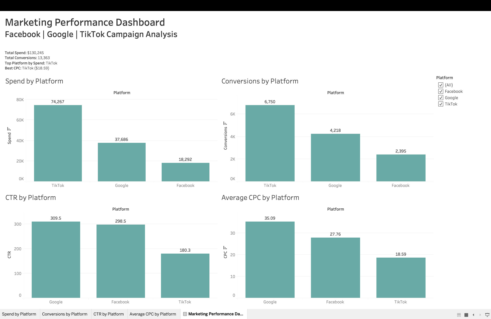

#  Marketing Analytics Dashboard

A unified multi-platform advertising analytics dashboard that consolidates performance data from **Facebook**, **Google**, and **TikTok** into a single Tableau view — enabling faster spend decisions and cross-channel comparison.

---

## Overview

Managing ad performance across multiple platforms means context-switching between dashboards and manually reconciling numbers. This project solves that by building a single source of truth: a combined dataset and interactive Tableau dashboard that tracks the metrics that actually matter.

---

## Metrics Tracked

| Metric | Description |
|---|---|
| **Spend** | Total ad spend per platform |
| **Conversions** | Actions completed (purchases, sign-ups, etc.) |
| **CTR** | Click-through rate — engagement efficiency |
| **CPC** | Cost per click — spend efficiency |

---

## Dashboard Features

- **Spend by Platform** — Compare budget allocation across Facebook, Google, and TikTok
- **Conversions by Platform** — Identify which channel drives the most results
- **CTR by Platform** — Spot engagement trends by channel
- **Average CPC by Platform** — Benchmark cost efficiency across networks
- **Interactive Platform Filter** — Drill down into any single channel or compare any combination

---

## Tech Stack

| Layer | Tools |
|---|---|
| Data Processing | Python, Pandas |
| Visualization | Tableau Public |

---

## Screenshots

---

## Getting Started

1. Clone the repository
2. Run the data pipeline script to generate the unified dataset
3. Open the Tableau workbook and connect to the output file
4. Use the platform filter to explore the data
